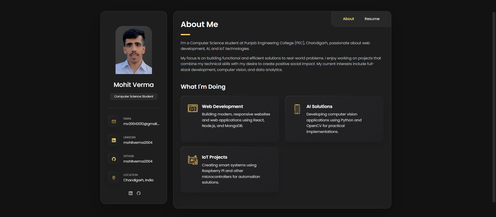

# HTML-CSS-Portfolio

A clean, responsive personal portfolio website built with pure HTML and CSS.

## Features
- Fully static (no JavaScript)
- Mobile-responsive design
- Easy to customize
- Fast loading

## Technologies
- HTML5
- CSS3

## How to Use
1. Clone this repository
2. Open `index.html` in any browser
3. Edit the HTML/CSS files with your information

## Customization Guide
- Replace placeholder images in `/images` folder
- Update your info in `index.html`
- Modify colors in `style.css`
